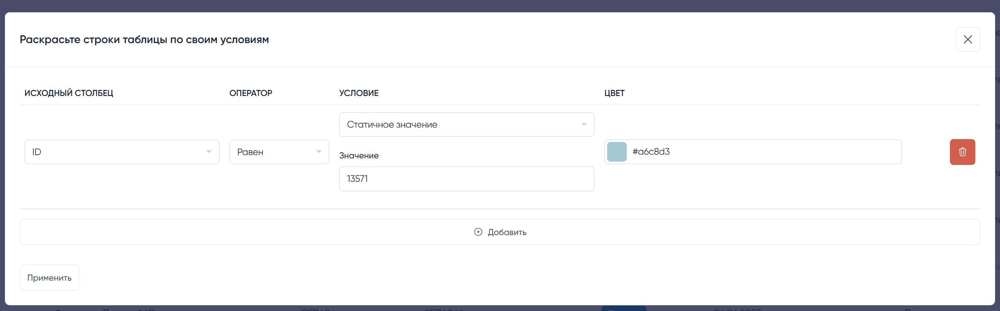

# Модуль пользовательской покраски строк индексной таблицы в  [MoonShine Laravel admin panel](https://moonshine-laravel.com) v3

Этот модуль позволяет добавить форму для раскраски строк в индекстной таблице ресурса по пользовательскому условию.

<picture>
  <source media="(prefers-color-scheme: dark)" srcset="./art/1.png">
  <source media="(prefers-color-scheme: light)" srcset="./art/1.png">
  
</picture>

## Установка
```shell
composer require ermakk/ms-table-colorize
```


## Поддерживает

| MoonShine | MoonShine Table Colorize | Currently supported |
|:---------:|:------------------------:|:-------------------:|
|  < v3.0   |           ...            |         no          |
| \>= v3.0  |         >= v1.0          |         yes         |


## Использование

Для добавления базового функционала, достаточно подключить трейт к ресурсу и добавить кнопку
```php
//...Resource.php

//class YourModelResource extends ModelResource
use Ermakk\MoonshineTableColorize\Traits\ColorizeTrAtribute;

// ...

protected function topButtons(): ListOf
{
    return parent::topButtons()
        ->add(
            ColorizeButton::make()->for($this)
        )
        ->// ... ваши кнопки
        ;
}

```

### Поля формы
По умолчанию модуль использует для формы поля индексной страницы, но вы можете настроить набор полей сами.

Для этого добавьте в ресурс метод `colorizeFields` который аналогично базовым методам MoonShine должен вернуть массив с набором полей

```php
//...Resource.php

//class YourModelResource extends ModelResource
use Ermakk\MoonshineTableColorize\Traits\ColorizeTrAtribute;

// ...

    public function colorizeFields(): array
    {
        return [
            // набор полей
        ];
    }
    
// ...

```

### Мягкое удаление

Так же из коробки плагин выделяет удаленные строки, 

чтобы включить или отключить это выделение переопределите параметр `colorizeSoftDeleteEnable`

```php
//...Resource.php

// ...
protected bool $colorizeSoftDeleteEnable = true; // true - включено, false - выключено
// ... 
```


### Курсор
Так же по умолчанию модуль добавляет стиль для курсора `cursor: pointer` строкам таблицы,

чтобы включить или отключить это выделение переопределите параметр `colorizeCursorPointer`

```php
//...Resource.php

// ...
protected bool $colorizeCursorPointer = true; // true - включено, false - выключено
// ... 
```

### Css аттрибут выделения
Вы можете изменить css аттрибут, которому будет задаваться цвет,

для этого задайте это значение в строковый параметр `colorizeStyleAttribute`

```php
//...Resource.php

// ...
protected string $colorizeStyleAttribute = 'background-color';
// ... 
```


## Изменение конфига

Помимо настроек из ресурса можно имезнить конфигурацию, для изменения конфигурации по-умолчанию:

```shell
php artisan vendor:publish --tag="moonshine-table-colorize"
```